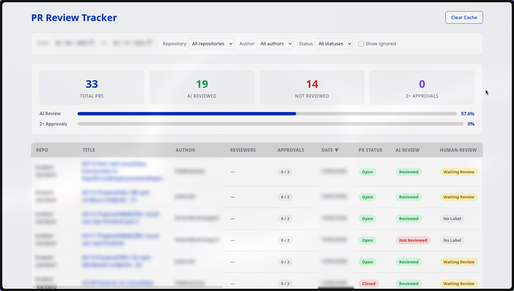

# PR Review Tracker

Dashboard for tracking AI code review compliance and approval goals across GitHub repositories.



## Prerequisites

- Python 3.11+
- [uv](https://docs.astral.sh/uv/) (Python package manager)
- Node.js 18+
- npm

## Setup

### 1. Get a GitHub Personal Access Token

1. Go to **GitHub > Settings > Developer settings > Personal access tokens > Tokens (classic)**
2. Click **Generate new token (classic)**
3. Give it a name (e.g. `pr-review-tracker`)
4. Select the **`repo`** scope (required for accessing PR data on repos you have access to)
5. Click **Generate token** and copy it

> If the repos you're tracking are public, you can create a token with no scopes — this still gives you 5,000 requests/hour instead of 60.

### 2. Configure environment

```bash
cd backend
cp .env.example .env
```

Edit `backend/.env` and paste your token:

```
GITHUB_TOKEN=ghp_your_token_here
```

### 3. Configure repositories

Edit `config.json` in the project root with the repos you want to track:

```json
{
  "repos": [
    "your-org/repo-one",
    "your-org/repo-two"
  ]
}
```

Use the `owner/repo` format (e.g. `facebook/react`).

## Running

### Backend

```bash
cd backend
uv sync
uv run uvicorn app.main:app --reload
```

The API will be available at `http://localhost:8000`.

### Frontend

```bash
cd frontend
npm install
npm run dev
```

The dashboard will be available at `http://localhost:5173`.

## Features

### Dashboard Stats

- **Total PRs**: Count of all PRs in the selected date range
- **AI Reviewed / Not Reviewed**: How many PRs received an AI code review
- **2+ Approvals**: How many PRs have been approved by at least 2 reviewers
- Two progress bars tracking AI review % and 2+ approvals %

### Table Columns

- **Repo**: Repository name
- **Title**: PR number and title (links to GitHub)
- **Author**: PR author
- **Reviewers**: Displayed as badges — green if the reviewer approved, red if not
- **Approvals**: Count of unique approvals out of 2 (e.g. `0 / 2`, `1 / 2`, `2 / 2`), color-coded (grey/yellow/green)
- **Date**: Creation date (dd/mm/yyyy)
- **PR Status**: Open (green), Merged (purple), Closed (red)
- **AI Review**: Whether the AI review bot commented
- **Human Review**: Based on PR labels — `wait-review` (yellow), `approved` (green), or "No Label" (grey)

All columns are sortable by clicking the header.

### Filters

- **Date range**: Filter PRs by creation date (defaults to last 7 days)
- **Repository**: Filter by a specific repo from your configured list
- **Author**: Filter by PR author
- **Status**: Filter by PR status (Open, Merged, Closed)
- **Show ignored**: Toggle to include PRs marked with `#ignore-tracker`

### Cache

- API responses are cached for 5 minutes to reduce GitHub API calls
- Click the **Clear Cache** button in the top-right corner to force a fresh fetch from GitHub

## How it works

- **AI Review detection**: A PR is marked as "Reviewed" if `github-actions[bot]` left a comment containing "Code Review"
- **Human Review detection**: Based on PR labels — `wait-review` shows "Waiting Review", `approved` shows "Approved"
- **Approval tracking**: Fetches PR reviews from GitHub API. Only counts a reviewer as an approver if their most recent review state is `APPROVED` (a later "changes requested" revokes it)
- **Reviewers**: Shows GitHub usernames of anyone who submitted a PR review (excluding bots), color-coded by approval status
- **Dependabot PRs** are automatically excluded
- **Ignore marker**: Add a comment containing `#ignore-tracker` to any PR to exclude it from the dashboard entirely
