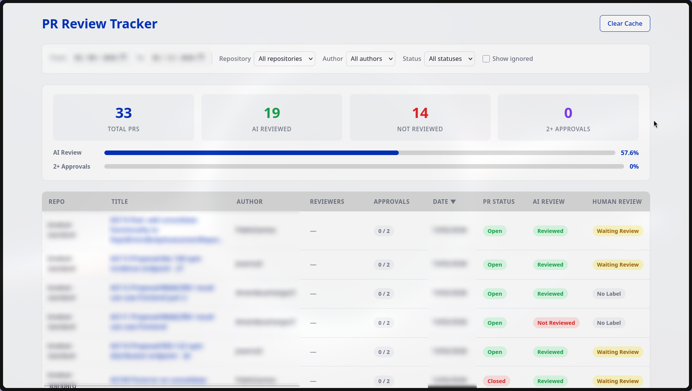

# PR Review Tracker

Dashboard for tracking AI code review compliance and approval goals across GitHub pull requests.



## Access Model

This app does not use server-side login.

- Each user enters their own GitHub personal access token in the browser.
- The token is stored in that browser only, using `localStorage`.
- The frontend sends the token to the backend on each request.
- The backend queries GitHub with that user's token, so users only see configured repositories they can actually access.
- Multiple users can use the same deployment at the same time without sharing GitHub permissions or cached results.

If you host this publicly, serve it over HTTPS. Users are trusting the site with their GitHub token.

## GitHub Token

For private repositories, create a classic GitHub personal access token with the `repo` scope:

1. Go to **GitHub > Settings > Developer settings > Personal access tokens > Tokens (classic)**.
2. Click **Generate new token (classic)**.
3. Give it a name such as `pr-review-tracker`.
4. Select the `repo` scope.
5. Generate the token and copy it.

If all tracked repositories are public, a token with no scopes also works and still gets the higher API rate limit.

## Configure Repositories

Edit [`config.json`](/Users/viniciusbregoli/Code/pr-data-dashboard/config.json) in the project root:

```json
{
  "repos": [
    "your-org/repo-one",
    "your-org/repo-two"
  ]
}
```

Only repositories listed in `config.json` are considered. Each user will see the subset their token can access.

## Run With Docker

First start:

```bash
docker compose up --build -d
```

After that, normal source edits reload automatically:

```bash
docker compose up -d
```

Notes:

- Frontend and backend source changes hot-reload inside Docker.
- If you change Python or npm dependencies, rebuild once with `docker compose up --build -d`.
- The frontend is available at [http://localhost:5173](http://localhost:5173).

## User Flow

1. Open the site.
2. Paste a GitHub token.
3. The app validates the token by checking repository access.
4. The token is saved in the browser so the user does not need to enter it again.
5. Users can replace the saved token with the `Change GitHub Token` button.

## How It Works

- **AI Review detection**: A PR is marked as `Reviewed` if `github-actions[bot]` left a comment containing `Code Review`.
- **Human Review detection**: Shows `Request Changes` if any reviewer has an active `CHANGES_REQUESTED` review. Otherwise `wait-review` shows `Waiting Review` and `approved` shows `Approved`.
- **Approval tracking**: A reviewer only counts as an approver if their latest effective review state is `APPROVED`.
- **Pending re-review handling**: If a reviewer is currently requested again, they are treated as waiting for the current review cycle instead of keeping an older review state.
- **Reviewers**: Shows GitHub usernames of reviewers and requested reviewers, excluding bots and the PR author.
- **Dependabot PRs**: Automatically excluded.
- **Ignore marker**: Add a comment containing `#ignore-tracker` to exclude a PR from the dashboard.
- **Cache scope**: Cached results are isolated per GitHub token, so users do not leak data to each other.

## Optional Configuration

If you use GitHub Enterprise, set `GITHUB_API_BASE` for the backend service to your API base URL.
